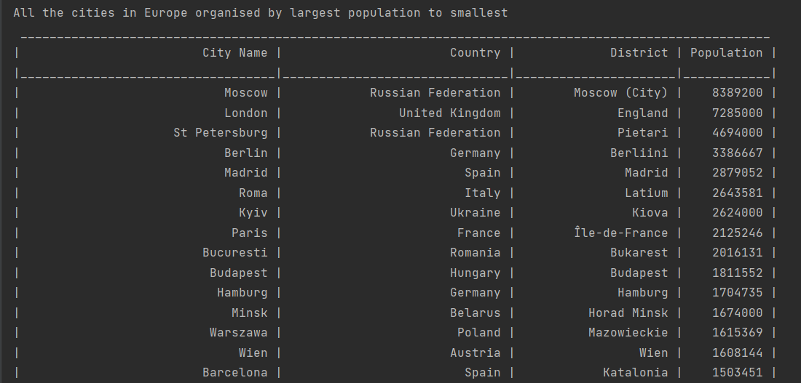
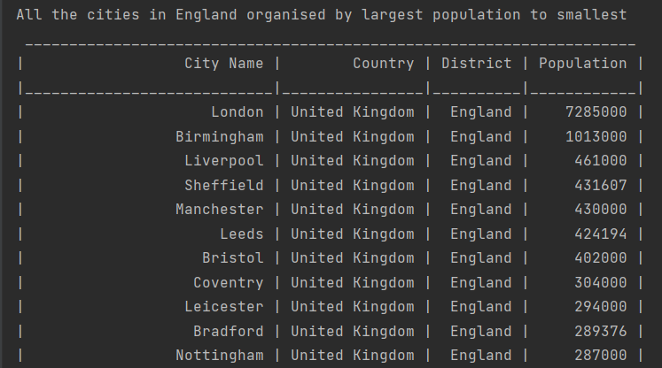
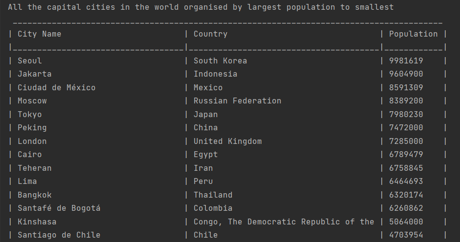
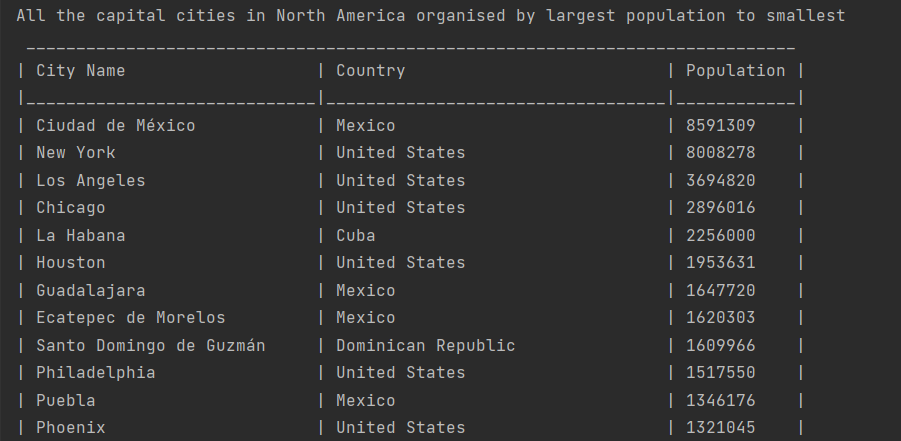
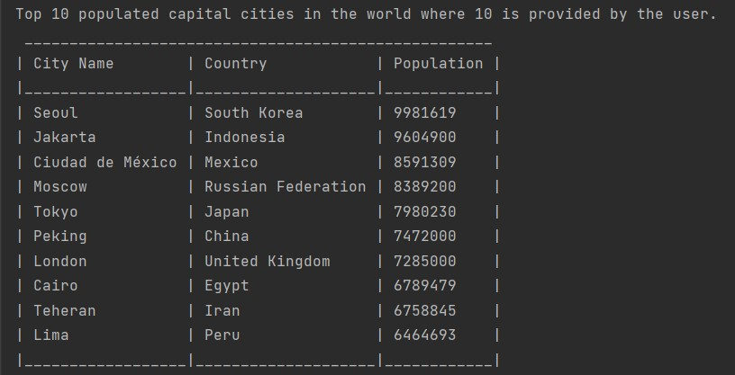
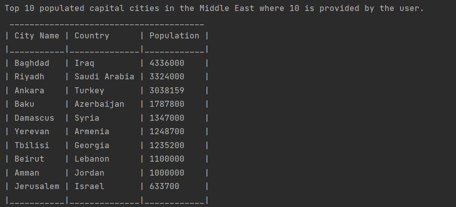

# SET09623 2021-2 TR2 001
Welcome to Our Population Report System from Group 7 

## 4 Members of Group 7
* Hein Htet Zaw
* Thiha Tun Tun
* Tsawm Nu Ra
* Yoon Shwe lwin

## Workflow Action and Build Badges
* WorkFlow Action 
* Master Build Status 

## Release and License
* Release 
* License 

## Link to Our Project from Zube
https://zube.io/gp7-2/earth/w/workspace-1/kanban

## Overview Outcome of Issues
Twenty-two requirements of thirty-two have been implemented.  

| No  | Description                                                                                                                                                 | Output Overview                                       |
|-----|-------------------------------------------------------------------------------------------------------------------------------------------------------------|:------------------------------------------------------|
| 01  | All the countries in the world organised by largest population to smallest                                                                                  |      |
| 02  | All the countries in a continent organised by largest population to smallest.                                                                               |  |
| 03  | All the countries in a region organised by largest population to smallest.                                                                                  |     |
| 04  | The top N populated countries in the world where N is provided by the user.                                                                                 |                                                       |
| 05  | The top N populated countries in a continent where N is provided by the user.                                                                               |                                                       |
| 06  | The top N populated countries in a region where N is provided by the user.                                                                                  |                                                       |
| 07  | All the cities in the world organised by largest population to smallest.                                                                                    |         |
| 08  | All the cities in a continent organised by largest population to smallest.                                                                                  |     |
| 09  | All the cities in a region organised by largest population to smallest.                                                                                     |        |
| 10  | All the cities in a country organised by largest population to smallest.                                                                                    |       |
| 11  | All the cities in a district organised by largest population to smallest.                                                                                   |      |
| 12  | The top N populated cities in the world where N is provided by the user.                                                                                    |                                                       |
| 13  | The top N populated cities in a continent where N is provided by the user.                                                                                  |                                                       |
| 14  | The top N populated cities in a region where N is provided by the user.                                                                                     |                                                       |
| 15  | The top N populated cities in a country where N is provided by the user.                                                                                    |                                                       |
| 16  | The top N populated cities in a district where N is provided by the user.                                                                                   |                                                       |
| 17  | All the capital cities in the world organised by largest population to smallest.                                                                            |        |
| 18  | All the capital cities in a continent organised by largest population to smallest.                                                                          |    |
| 19  | All the capital cities in a region organised by largest to smallest.                                                                                        |                                                       |
| 20  | The top N populated capital cities in the world where N is provided by the user.                                                                            |        |
| 21  | The top N populated capital cities in a continent where N is provided by the user.                                                                          |    |
| 22  | The top N populated capital cities in a region where N is provided by the user.                                                                             |       |
| 23  | The population of people, people living in cities, and people not living in cities in each continent.                                                       |                                                       |
| 24  | The population of people, people living in cities, and people not living in cities in each region.                                                          |                                                       |
| 25  | The population of people, people living in cities, and people not living in cities in each country.                                                         |                                                       |
| 26  | The population of the world should be accessible to the organisation.                                                                                       |                                                       |
| 27  | The population of a continent should be accessible to the organisation.                                                                                     |                                                       |
| 28  | The population of a region should be accessible to organisation.                                                                                            |                                                       |
| 29  | The population of a country should be accessible to organisation.                                                                                           |                                                       |
| 30  | The population of a district should be accessible to organisation.                                                                                          |                                                       |
| 31  | The population of a city should be accessible to organisation.                                                                                              |                                                       |
| 32  | The number of people who speak Chinese, English, Hindi, Spanish, Arabic from greatest number to smallest, including the percentage of the world population. |                                                       |

